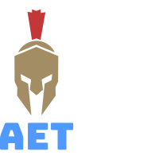

## 
> *Ancient Era Tech*

## Purpose

For far too long the ancient genre has not been able to come to widespread adoption of a new technology. We believe this is because new ancient genre technologies contain some of the following:

1. a lack of customizability
2. a hard to learn combat system 
3. or a lack of combat depth 
3. not being open sourced

AET plans to change this by introducing a combat system which has almost no initial learning curve yet retains depth and is open sourced and easily customizable. Below you'll find some of planned features which we hope will set apart this system from others and lead it to widespread adoption.

## Game Components

### Config
> Files: [Config]
- This is where you can edit game components by enabling or disabling them (such as gore, body rotation, sprinting, etc),

### InputController
> Files [InputController]
- Manages the sending of player input to the server through the network. Currently only compatible for pc. We are planning mobile compatible later on.

### Camera Controllers
Various camera controllers...

	#### SpringCamera
	> Toggleable, Files: [SpringCamera]
	- Manages the creation and destruction of a spring camera on the player. Utilizes spring module. 
	#### CameraShake
	> Toggleable, Files: [CameraShake]
	- Listens to events such as "hit", "blocked", "swing", and adds a shake effect to the camera.
	#### CameraDirection
	> Toggleable, Files: [CameraDirection]
	- Tracks the player camera and fires a signal giving info on the player's camera direction (up or down).

### BodyRotator
> Toggleable, Files: [RotationController, RotationService]
- Tracks camera rotation and rotates the body accordingly. This is what allows for the directional combat however it can be completely disabled.

### Sprinting 
> Toggleable, Files: [SprintingService]
- Player should be able to toggle sprinting across the map. Sprinting will not have to interact with many modules of the game allowing it to easily be disabled and enabled by game devs. 

### ToolService
> Files: [ToolService]
- There tool service handles the giving of tools (weapons, shields, etc) to players through checking for models in the player's backpack which have a tool's name and then creating the tool on that character.
	#### Tool
	> Files: [Tool]
	- This is a component which attaches to the a tool model and directly utilizes actionpacks.
	#### ActionPack
	> Files: [Essential, Weapon, Shield]
	- An actionpack creates several actions and packs them into one unit. This is important because these actions frequently communicate with each other through creating new attributes in the Action and Tool classes. If an action sets an attribute in the Action class it means it only expects other methods in the action (start, cancel, finish) to utilize it. If it sets an attribute in the Tool class it means it expects other actions in the action pack to utilize it (such as the holster action and equip action disabling the other animation which was set to an attribute of the tool when they start).
	#### Action
	> Files: [Action]
	- An action consists of the following methods: start, cancel, and finish. It has one main variable which is accessed by the tool called "state". 

